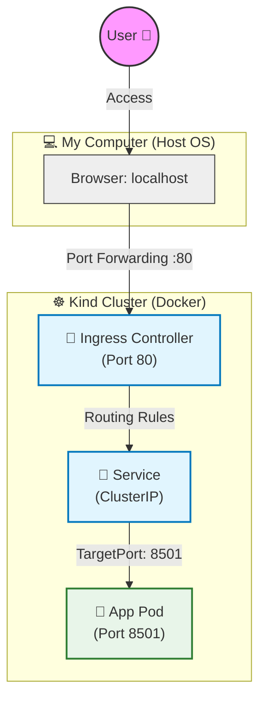
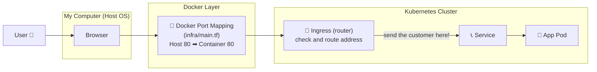
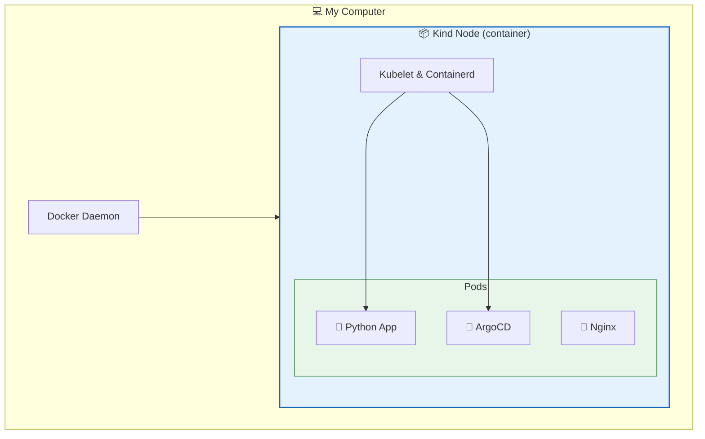

```mermaid
graph TD
    %% 스타일 정의
    classDef user fill:#f9f,stroke:#333,stroke-width:2px;
    classDef host fill:#eee,stroke:#333,stroke-width:1px;
    classDef k8s fill:#e1f5fe,stroke:#0277bd,stroke-width:2px;
    classDef pod fill:#e8f5e9,stroke:#2e7d32,stroke-width:2px;

    %% 노드 정의
    User((User 👤)):::user
    
    subgraph Host_Machine ["💻 My Computer (Host OS)"]
        Browser["Browser: localhost"]:::host
    end

    subgraph Kind_Cluster ["☸️ Kind Cluster (Docker)"]
        direction TB
        Ingress["🚪 Ingress Controller<br/>(Port 80)"]:::k8s
        Service["🧱 Service<br/>(ClusterIP)"]:::k8s
        Pod["🍳 App Pod<br/>(Port 8501)"]:::pod
    end

    %% 연결선
    User -->|Access| Browser
    Browser -->|Port Forwarding :80| Ingress
    Ingress -->|Routing Rules| Service
    Service -->|TargetPort: 8501| Pod

    %% 설명 추가
    click Ingress "First place to receive inbound traffic"
    click Service "Virtual IP for internal network connection"
```

```mermaid 
graph LR
    User["User 👤"] 
    
    subgraph Host ["My Computer (Host OS)"]
        Browser["Browser"]
    end

    subgraph Docker["Docker Layer"]
        Mapping["🚧 Docker Port Mapping<br/>(infra/main.tf)<br/>Host 80 ➡ Container 80"]
    end

    subgraph Cluster ["Kubernetes Cluster"]
        Ingress["🚦 Ingress (router)<br/>check and route address"]
        Service["📞 Service"]
        Pod["🍳 App Pod"]
    end

    User --> Browser
    Browser --> Mapping
    Mapping --> Ingress
    Ingress -->|"send the customer here!"| Service
    Service --> Pod

```

```mermaid
graph TD
    subgraph Host_PC ["💻 My Computer"]
        DockerEngine["Docker Daemon"]
        
        subgraph Kind_Container ["📦 Kind Node (container)"]
            style Kind_Container fill:#e3f2fd,stroke:#1565c0,stroke-width:2px
            
            Kubelet["Kubelet & Containerd"]
            
            subgraph Inner_Containers ["Pods"]
                style Inner_Containers fill:#e8f5e9,stroke:#2e7d32
                App["🐍 Python App"]
                Argo["🐙 ArgoCD"]
                Ingress["🚦 Nginx"]
            end
        end
    end

    DockerEngine ----> Kind_Container
    Kubelet ----> App
    Kubelet ----> Argo

```